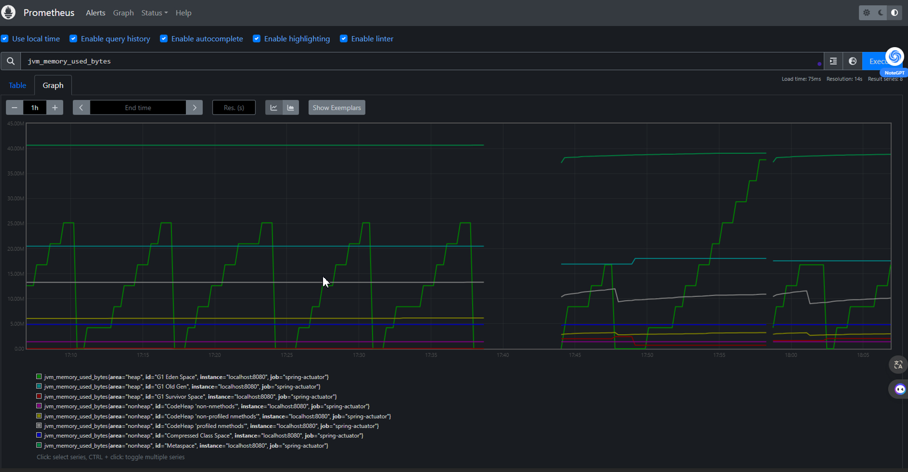
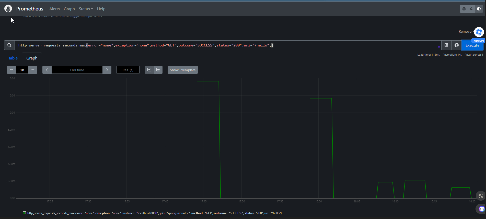
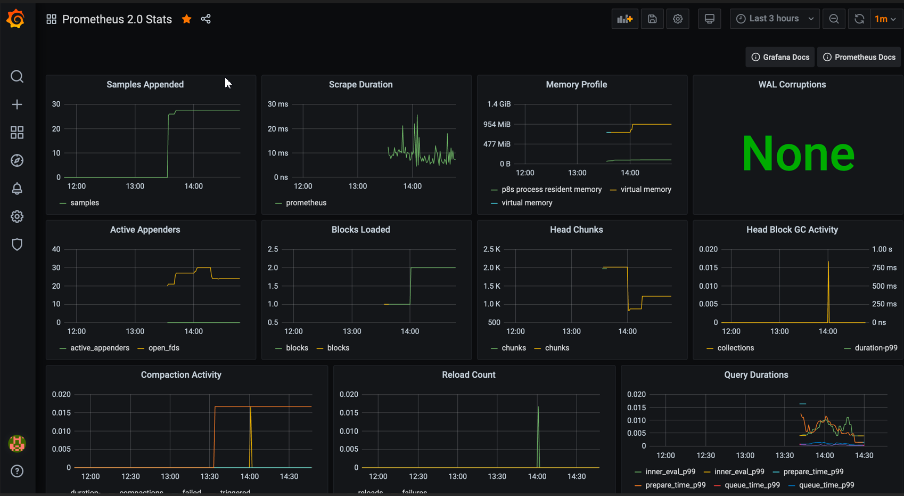

## Урок 11. Spring Actuator. Настройка мониторинга с Prometheus и Grafana.

Задание: Используйте Spring Actuator для отслеживания метрик вашего приложения. Настройте визуализацию этих метрик с использованием Prometheus и Grafana.

## Prometheus

### Файл конфиг Prometheus [prometheus.yml](https://github.com/MilaVoroina97/Spring_HW11/tree/main/src/main/resources/yaml)

## Grafana

